# Data Science Interview Questions

A comprehensive collection of interview questions covering Statistics, Data Science, Machine Learning, Deep Learning, NLP, and Computer Vision — with explanatory graphics and visualizations.

---

## Table of Contents

1. [Statistics](#statistics)
2. [Data Science](#data-science)
3. [Data Analysis](#data-analysis)
4. [Machine Learning](#machine-learning)
5. [Deep Learning](#deep-learning)
6. [Miscellaneous](#miscellaneous)
7. [Python Programming](#python-programming)
8. [NumPy](#numpy)
9. [Pandas](#pandas)
10. [Python Language](#python-language)
11. [Jupyter Notebook](#jupyter-notebook)
12. [Top 100 Machine Learning Questions](#top-100-machine-learning-questions)
13. [Top 100 NLP Questions](#top-100-nlp-questions)
14. [Top 100 Computer Vision Questions](#top-100-computer-vision-questions)

---

## Statistics

### Q1. What is the Central Limit Theorem and why is it important?

Suppose that we are interested in estimating the average height among all people. Collecting data for every person in the world is impractical, bordering on impossible. While we can't obtain a height measurement from everyone in the population, we can still sample some people. The question now becomes, what can we say about the average height of the entire population given a single sample.

The Central Limit Theorem addresses this question exactly. Formally, it states that if we sample from a population using a sufficiently large sample size, the mean of the samples (also known as the sample population) will be normally distributed (assuming true random sampling), the mean tending to the mean of the population and variance equal to the variance of the population divided by the size of the sampling.

**What's especially important is that this will be true regardless of the distribution of the original population.**

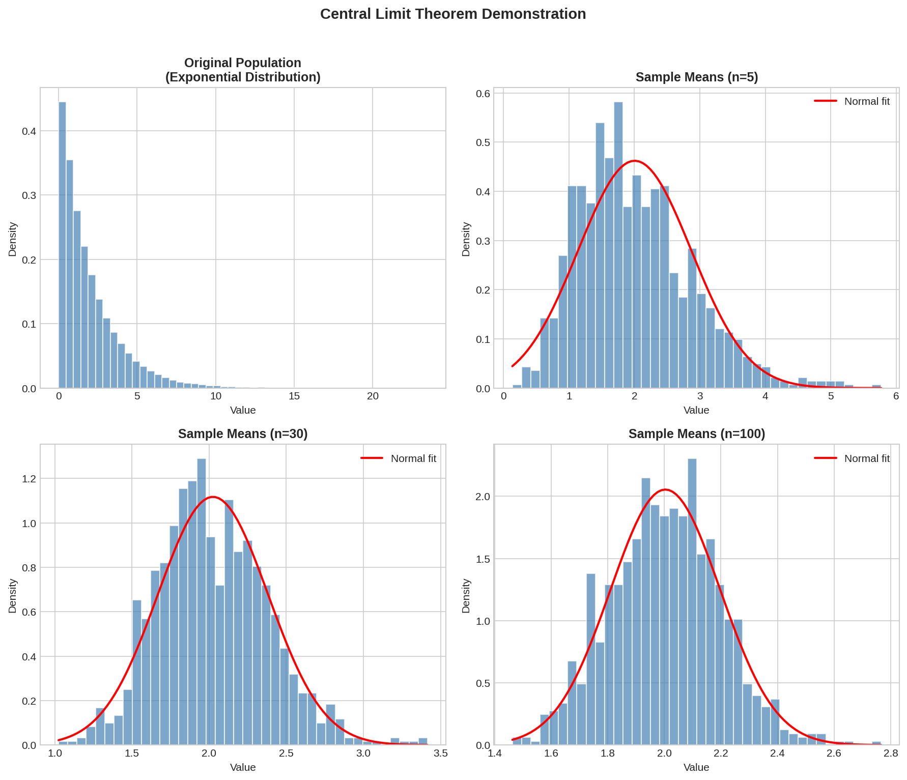

*As we can see in the visualization above, even when the original population follows an exponential distribution (top-left), the sampling distribution of means becomes increasingly normal as sample size increases. With N=100 (bottom-right), the distribution is nearly perfectly normal.*

**Example:**
- Suppose we gather 1,000 samples of 3 from a population
- For each sample, we compute its average
- This set of 1,000 averages is called a sampling distribution
- According to the Central Limit Theorem, the sampling distribution will approach a normal distribution as the sample size N increases

---

### Q2. What is sampling? How many sampling methods do you know?

Data sampling is a statistical analysis technique used to select, manipulate and analyze a representative subset of data points to identify patterns and trends in the larger data set being examined. It enables data scientists, predictive modelers and other data analysts to work with a small, manageable amount of data about a statistical population to build and run analytical models more quickly, while still producing accurate findings.

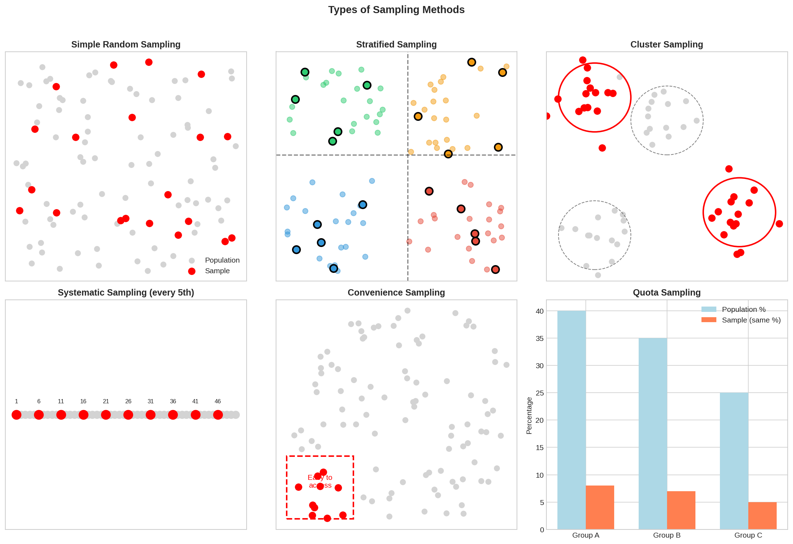

*The visualization above shows the six main sampling methods: Simple Random (random selection), Stratified (proportional from subgroups), Cluster (select entire groups), Systematic (every nth item), Convenience (easily accessible), and Quota (maintain proportions).*

#### Probability-Based Sampling Methods:

1. **Simple Random Sampling**: Software is used to randomly select subjects from the whole population

2. **Stratified Sampling**: Subsets of the data sets or population are created based on a common factor, and samples are randomly collected from each subgroup

3. **Cluster Sampling**: The larger data set is divided into subsets (clusters) based on a defined factor, then a random sampling of clusters is analyzed

4. **Multistage Sampling**: A more complicated form of cluster sampling involving dividing the population into clusters, then further subdividing based on secondary factors

5. **Systematic Sampling**: A sample is created by setting an interval at which to extract data from the larger population (e.g., selecting every 10th row)

#### Non-Probability Sampling Methods:

1. **Convenience Sampling**: Data is collected from an easily accessible and available group

2. **Consecutive Sampling**: Data is collected from every subject that meets the criteria until the predetermined sample size is met

3. **Purposive/Judgmental Sampling**: The researcher selects the data to sample based on predefined criteria

4. **Quota Sampling**: The researcher ensures equal representation within the sample for all subgroups

---

### Q3. What is the difference between Type I vs Type II error?

| | No Reject H₀ | Reject H₀ |
|---|---|---|
| **H₀ is True** | True Negative (TN) | False Positive (Type I Error) |
| **H₀ is False** | False Negative (Type II Error) | True Positive (TP) |

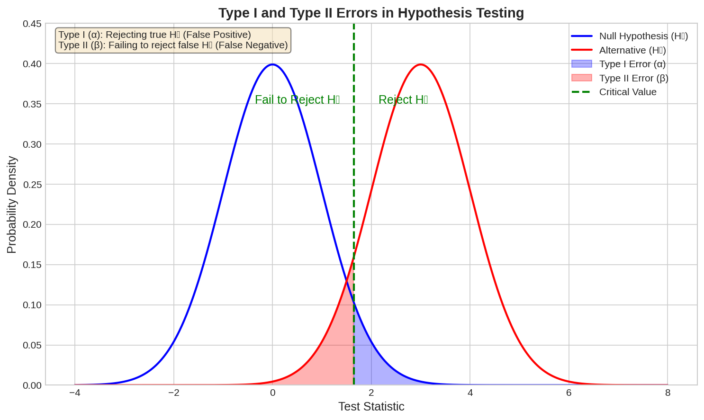

*This visualization shows how Type I (α) and Type II (β) errors relate to hypothesis testing. The blue distribution represents the null hypothesis, while the red represents the alternative. Type I error (false positive) occurs in the blue shaded region when we reject a true null hypothesis. Type II error (false negative) occurs in the red shaded region when we fail to reject a false null hypothesis.*

- **Type I Error**: Occurs when the null hypothesis is true but is rejected (False Positive)
- **Type II Error**: Occurs when the null hypothesis is false but erroneously fails to be rejected (False Negative)

---

### Q4. What is linear regression? What do the terms p-value, coefficient, and R-squared value mean?

Linear regression assumes there is a linear relationship between independent variables and the dependent variable (price):

**ŷ = β₀ + β₁x₁ + β₂x₂ + ...**

- **P-value**: The minimum significance level at which the coefficient is relevant. The lower the p-value, the more important the variable. Usually a 5% level is set for 95% confidence.

- **Coefficient**: Signifies how much the mean of the dependent variable changes given a one-unit shift in the independent variable while holding other variables constant.

- **R-squared (R²)**: A statistical measure that represents the proportion of the variance for a dependent variable that's explained by the independent variables in the regression model.

---

### Q5. What are the assumptions required for linear regression?

1. **Linearity**: There is a linear relationship between the dependent variables and the regressors
2. **Normality of Residuals**: The errors or residuals are normally distributed and independent from each other
3. **No Multicollinearity**: Minimal multicollinearity between explanatory variables
4. **Homoscedasticity**: The variance around the regression line is the same for all values of the predictor variable

---

### Q6. What is a statistical interaction?

An interaction occurs when the effect of one factor (input variable) on the dependent variable differs among levels of another factor. When two or more independent variables are involved in a research design, the effect of one independent variable may depend on the level of the other independent variable.

**Example**: Stress level and practice to memorize words — together they may have a lower performance than expected from individual effects.

---

### Q7. What is selection bias?

Selection (or 'sampling') bias occurs when the sample data that is gathered and prepared for modeling has characteristics that are not representative of the true, future population of cases the model will see. Active selection bias occurs when a subset of the data is systematically (non-randomly) excluded from analysis.

---

### Q8. What is an example of a data set with a non-Gaussian distribution?

- **Binomial Distribution**: Multiple tosses of a coin — Bin(n,p)
- **Bernoulli Distribution**: Single coin toss — Bin(1,p) = Be(p)
- **Poisson Distribution**: Pois(λ) — count of events in a fixed interval

---

## Data Science

### Q1. What is Data Science? List the differences between supervised and unsupervised learning.

Data Science is a blend of various tools, algorithms, and machine learning principles with the goal to discover hidden patterns from the raw data. The difference from traditional statistics lies in the difference between explaining and predicting: statisticians work *a posteriori*, explaining the results; data scientists use historical data to make predictions.

| Supervised Learning | Unsupervised Learning |
|---|---|
| Input data is labeled | Input data is unlabeled |
| Split into training/validation/test | No split required |
| Used for prediction | Used for analysis |
| Classification and Regression | Clustering, Dimension Reduction, Density Estimation |

---

### Q2. What is Selection Bias?

Selection bias is a kind of error that occurs when the researcher decides what has to be studied. It is associated with research where the selection of participants is not random.

**Types of selection bias include:**
- **Sampling Bias**: Systematic error due to non-random sample
- **Time Interval Bias**: Trial terminated early at extreme values
- **Data Bias**: Specific subsets chosen to support a conclusion
- **Attrition Bias**: Caused by loss of participants

---

### Q3. What is bias-variance trade-off?

**Bias**: Error introduced due to oversimplification of the algorithm. Can lead to underfitting.
- Low bias: Decision Trees, k-NN, SVM
- High bias: Linear Regression, Logistic Regression

**Variance**: Error introduced due to too complex an algorithm. Can lead to overfitting and high sensitivity.

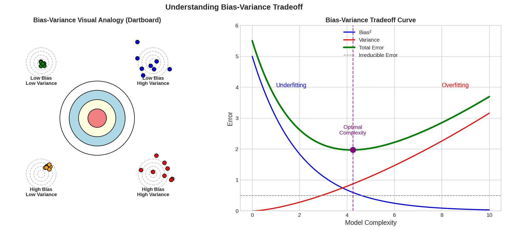

*The left panel shows a dartboard analogy: Low bias means hitting near the center; low variance means hits are clustered together. The right panel shows how total error varies with model complexity — too simple leads to underfitting (high bias), too complex leads to overfitting (high variance). The optimal model lies at the minimum of the total error curve.*

**Trade-off**: The goal is to achieve low bias AND low variance. As model complexity increases, bias decreases but variance increases. The optimal point lies somewhere in the middle.

**Strategies to manage the trade-off:**
1. **k-NN**: Increase k to increase bias and decrease variance
2. **SVM**: Increase C parameter to increase bias and decrease variance
3. **Decision Trees**: Decrease depth or use fewer attributes
4. **Linear Regression**: Increase features or use a different regression model

---

### Q4. What is a confusion matrix?

A 2×2 table containing 4 outputs from a binary classifier:

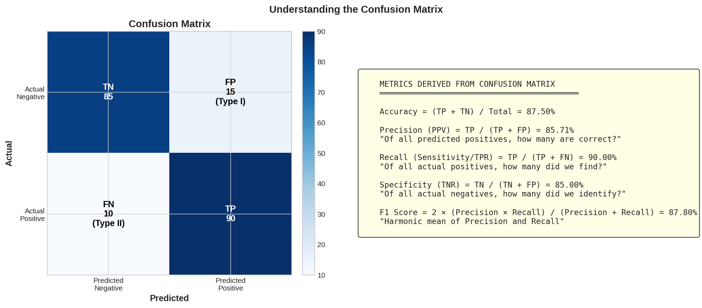

*The left panel shows a confusion matrix with actual counts (TP=90, TN=85, FP=15, FN=10). The right panel shows all the metrics that can be derived from a confusion matrix including accuracy, precision, recall, specificity, and F1 score with their formulas.*

| | Predict + | Predict - |
|---|---|---|
| **Actual +** | True Positive (TP) | False Negative (Type II) |
| **Actual -** | False Positive (Type I) | True Negative (TN) |

**Key Metrics:**
- **Error Rate** = (FP + FN) / Total
- **Accuracy** = (TP + TN) / Total
- **Sensitivity (Recall/TPR)** = TP / (TP + FN)
- **Specificity (TNR)** = TN / (TN + FP)
- **Precision (PPV)** = TP / (TP + FP)
- **F1-Score** = 2 × (Precision × Recall) / (Precision + Recall)

---

### Q5. What is the difference between "long" and "wide" format data?

- **Wide Format**: A subject's repeated responses are in a single row, each response in a separate column. Columns generally represent groups/variables.
- **Long Format**: Each row is one time point per subject.

---

### Q6. What do you understand by the term Normal Distribution?

Data distributed around a central value without bias, forming a bell-shaped curve.

**Properties of Normal Distribution:**
1. Unimodal (only one mode)
2. Symmetrical (left and right halves are mirror images)
3. Bell-shaped (maximum height at the mean)
4. Mean, Mode, and Median are all located in the center
5. Asymptotic

---

### Q7. What is correlation and covariance in statistics?

**Correlation**: Measures how strongly two variables are related. It is the covariance divided by the product of standard deviations:

ρ = Cov(X, Y) / (σ(X) × σ(Y)) ∈ [-1, 1]

**Covariance**: Indicates the extent to which two random variables change in cycle:

Cov(X, Y) = E[(X - E[X])(Y - E[Y])] = E[XY] - E[X]E[Y]

---

### Q8. What is the difference between Point Estimates and Confidence Interval?

- **Point Estimation**: Gives a particular value as an estimate of a population parameter (using Method of Moments or Maximum Likelihood)
- **Confidence Interval**: Gives a range of values likely to contain the population parameter, with a specified confidence level (1 - α)

---

### Q9. What is the goal of A/B Testing?

A/B Testing is hypothesis testing for a randomized experiment with two variables A and B. The goal is to identify changes to a web page to maximize or increase the outcome of interest (e.g., click-through rate for a banner ad).

---

### Q10. What is p-value?

The p-value is the minimum significance level at which you can reject the null hypothesis. The lower the p-value, the more likely you reject the null hypothesis.

---

### Q11. Shooting Star Probability Problem

*In any 15-minute interval, there is a 20% probability that you will see at least one shooting star. What is the probability that you see at least one shooting star in one hour?*

**Solution:**
- P(not seeing any star in 15 min) = 1 - 0.2 = 0.8
- P(not seeing any star in 1 hour) = (0.8)⁴ = 0.4096
- P(seeing at least one star in 1 hour) = 1 - 0.4096 = **0.5904**

---

### Q12. How can you generate a random number between 1-7 with only a die?

Roll the die twice to get 36 different outcomes. Exclude (6,6) and roll again if it appears. The remaining 35 combinations can be divided into 7 groups of 5 each, making all seven outcomes equally likely.

---

### Q13-Q14. Probability Problems

**Q13**: Two children, at least one girl → P(two girls) = 1/3

**Q14**: 1000 coins (999 fair, 1 double-headed), 10 heads in a row → P(next toss is head) ≈ 0.7531

---

### Q15. What is statistical power/sensitivity?

Sensitivity measures the accuracy of a classifier:

**Sensitivity = TP / (TP + FN)**

---

### Q16. Why is Re-sampling done?

Resampling estimates population parameters multiple times from a data sample to:
- Improve accuracy of estimates
- Quantify uncertainty

**Common methods:**
- **Bootstrap**: Samples drawn with replacement
- **k-fold Cross-Validation**: Dataset partitioned into k groups for training/testing

---

### Q17. What are the differences between overfitting and underfitting?

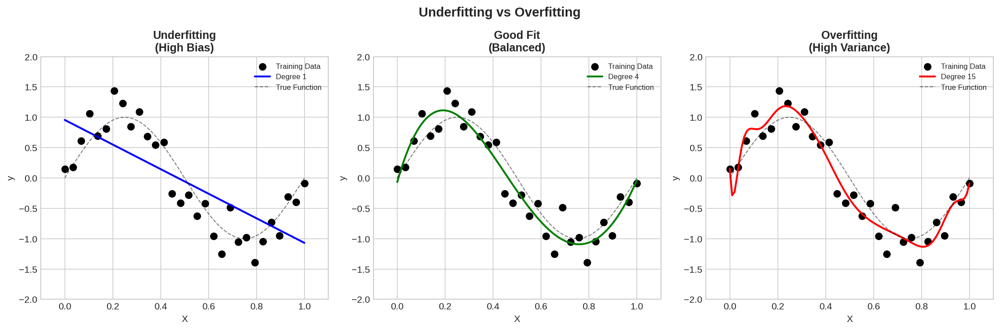

*This visualization shows three polynomial fits to the same data: Left (underfitting) - a degree-1 polynomial is too simple and misses the pattern. Center (good fit) - a degree-4 polynomial captures the underlying trend. Right (overfitting) - a degree-15 polynomial follows the noise exactly but generalizes poorly.*

- **Overfitting**: Model learns random noise instead of underlying patterns. Too complex, poor generalization.
- **Underfitting**: Model cannot capture the underlying trend. Too simple, poor performance on both training and test data.

---

### Q18. How to combat Overfitting and Underfitting?

**Combat Overfitting:**
1. Add noise
2. Feature selection
3. Increase training set
4. L2 (Ridge) or L1 (Lasso) regularization
5. Cross-validation techniques
6. Boosting and bagging
7. Dropout technique
8. Early stopping
9. Remove inner layers

**Combat Underfitting:**
1. Add features
2. Increase training time

---

### Q19. What is regularization? Why is it useful?

Regularization adds a penalty term to prevent overfitting by inducing smoothness:
- **L1 (Lasso)**: |α| — tends to produce sparse solutions
- **L2 (Ridge)**: α² — shrinks coefficients

---

### Q20. What Is the Law of Large Numbers?

The average of results from a large number of trials should be close to the expected value and will tend to become closer as more trials are performed.

---

### Q21. What Are Confounding Variables?

A confounder is a variable that influences both the dependent and independent variables.

**Example**: Researching whether lack of exercise leads to weight gain — age could be a confounding variable affecting both.

---

### Q22. What Are the Types of Biases in Sampling?

1. Selection bias
2. Under coverage bias
3. Survivorship bias

---

### Q23. What is Survivorship Bias?

The logical error of focusing on aspects that survived some process while overlooking those that did not due to their lack of prominence.

**Example**: During a recession, looking only at survived businesses and noting poor performance, while ignoring failed businesses that performed even worse.

---

### Q24. What is Under Coverage Bias?

Under coverage bias occurs when some members of the population are inadequately represented in the sample.

**Classic Example**: The 1936 Literary Digest voter survey that relied on telephone directories and car registration lists, under-representing low-income voters.

---

### Q25. Explain how a ROC curve works

The ROC curve is a graphical representation of True Positive Rate vs. False Positive Rate at various thresholds.

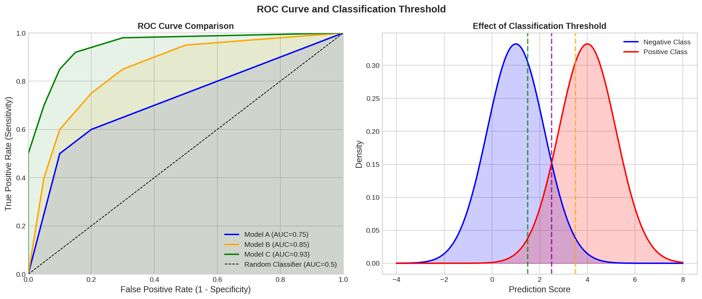

*The left panel shows ROC curves for three models with different AUC values. Model C (AUC=0.93) performs best, as its curve is closest to the top-left corner. The diagonal line represents a random classifier. The right panel shows how different classification thresholds affect the trade-off between true and false positives.*

- **TPR (Sensitivity)** = TP / (TP + FN)
- **FPR (1 - Specificity)** = FP / (FP + TN)

---

### Q26. What is TF-IDF vectorization?

TF-IDF (Term Frequency-Inverse Document Frequency) reflects how important a word is to a document in a corpus.

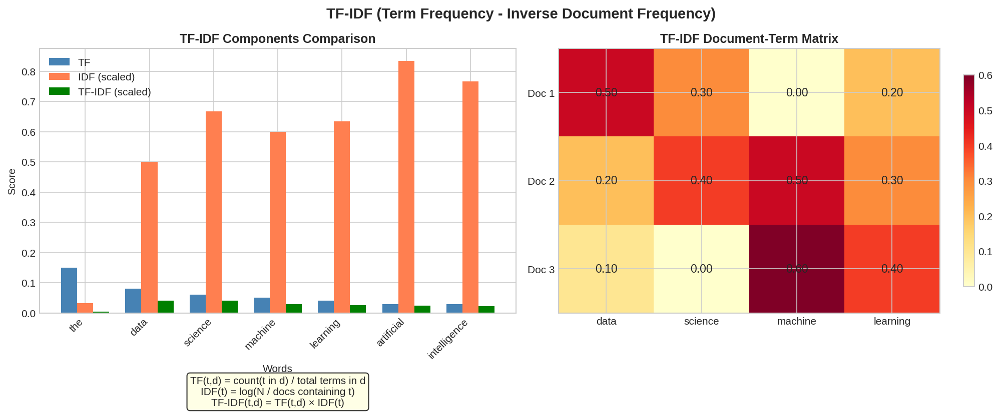

*The left panel compares TF, IDF, and TF-IDF scores for different words. Common words like "the" have high TF but low IDF, resulting in low TF-IDF. Domain-specific words like "artificial" have moderate TF but high IDF, giving them high importance. The right panel shows a TF-IDF document-term matrix.*

- **TF** = (# times term appears in document) / (Total # terms in document)
- **IDF** = log(# documents / # documents containing term)

The TF-IDF value increases with word frequency in a document but is offset by frequency in the corpus.

---

### Q27. Why use Softmax/Sigmoid as the last layer? Why ReLU in inner layers?

- **Softmax/Sigmoid**: Takes a vector of real numbers and returns a probability distribution (outputs sum to 1)
- **ReLU in inner layers**: Avoids the vanishing gradient problem

---

## Data Analysis

### Q1. Python or R – Which for text analytics?

**Python** is preferred because:
- Pandas library provides easy-to-use data structures
- Performs faster for text analytics
- R is more suited for general machine learning

---

### Q2. How does data cleaning play a vital role in analysis?

- Transforms data from multiple sources into workable format
- Increases model accuracy
- May take up to 80% of project time
- Critical for reliable analysis results

---

### Q3. Differentiate between univariate, bivariate and multivariate analysis

- **Univariate**: One variable (e.g., pie charts of sales by territory)
- **Bivariate**: Two variables (e.g., scatterplot of volume vs. spending)
- **Multivariate**: Three or more variables (e.g., house price prediction with multiple features)

---

### Q4. Explain Star Schema

A traditional database schema with a central fact table connected to satellite lookup tables (dimension tables) via ID fields. Useful in real-time applications for saving memory.

---

### Q5. What is Cluster Sampling?

A technique where the target population is divided into clusters, then entire clusters are randomly selected for analysis. Used when the population is spread across a wide area.

---

### Q6. What is Systematic Sampling?

Elements are selected from an ordered sampling frame at regular intervals (e.g., every 10th item). The list is progressed in a circular manner.

---

### Q7. What are Eigenvectors and Eigenvalues?

- **Eigenvectors**: Directions along which a linear transformation acts by flipping, compressing, or stretching
- **Eigenvalues**: The strength/factor of the transformation in the eigenvector direction

---

### Q8-Q10. False Positive vs False Negative Examples

**False Positive more important:**
- Medical: Giving chemotherapy to someone without cancer
- E-commerce: Sending vouchers to non-qualifying customers

**False Negative more important:**
- Criminal justice: Letting a criminal go free
- Fraud detection: Missing actual fraud

**Both equally important:**
- Banking loans: Don't want to lose good customers OR acquire bad ones

---

### Q11. Difference between Validation Set and Test Set

- **Training Set**: Fit the model parameters (weights)
- **Validation Set**: Part of training data for parameter selection and avoiding overfitting
- **Test Set**: Evaluate model performance and generalization

---

### Q12. Explain cross-validation

Cross-validation evaluates machine learning models on limited data by partitioning data into k groups:

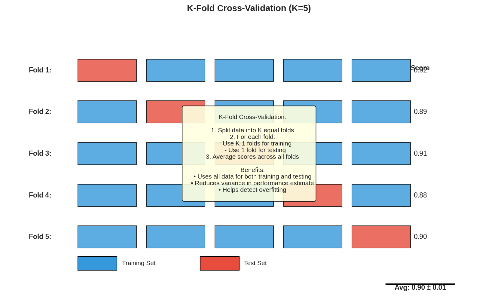

*This visualization shows 5-fold cross-validation. Each row represents a fold where a different portion serves as the test set (red) while the rest is used for training (blue). The scores from all folds are averaged to get a robust performance estimate.*

1. Shuffle the dataset randomly
2. Split into k groups
3. For each group:
   - Use as test set, remaining as training
   - Fit model and evaluate
   - Retain score, discard model
4. Summarize with average of scores

**Stratified k-fold** ensures representative class distribution in each fold.

---

## Machine Learning

### Q1. What is Machine Learning?

The study of algorithms that improve automatically through experience. Used to devise models for prediction (predictive analytics). You select a model, train it, then perform feature extraction.

---

### Q2. What is Supervised Learning?

Learning from labeled training data to infer a function.

**Algorithms**: SVM, Regression, Naive Bayes, Decision Trees, K-NN, Neural Networks

---

### Q3. What is Unsupervised Learning?

Drawing inferences from datasets without labeled responses.

**Algorithms**: Clustering, Anomaly Detection, Neural Networks, Latent Variable Models

---

### Q4. What are the various algorithms?

- Supervised: Linear/Logistic Regression, Decision Trees, SVM, Naive Bayes, k-NN, Random Forest
- Unsupervised: K-Means, Hierarchical Clustering, DBSCAN, PCA
- Ensemble: Bagging, Boosting, Random Forest, XGBoost

---

### Q5. What is 'Naive' in Naive Bayes?

The "naive" assumption of conditional independence between every pair of features given the class variable:

P(x₁, ..., xₙ|y) = ∏ P(xᵢ|y)

Different Naive Bayes classifiers differ in their assumptions about P(xᵢ|y): Bernoulli, Binomial, Gaussian, etc.

---

### Q6. What is PCA? When do you use it?

Principal Component Analysis projects data from higher to lower dimensional space by maximizing variance of each dimension.

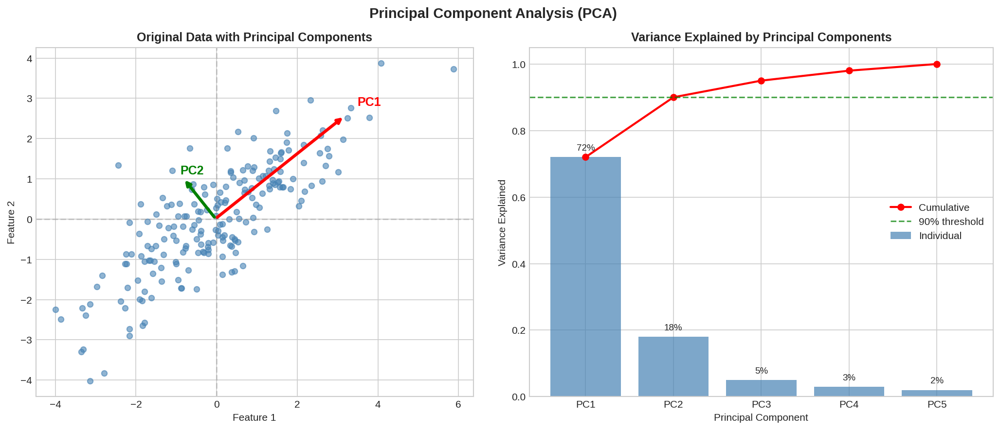

*The left panel shows original 2D data with the two principal components (PC1 and PC2) indicated by arrows. PC1 captures the direction of maximum variance. The right panel shows a scree plot indicating how much variance each component explains — typically we keep components that explain ~90% of total variance.*

**Process:**
1. Standardize features to unit variance
2. Compute covariance matrix
3. Find eigenvectors (principal components) and eigenvalues
4. Project data onto principal components

**Use cases**: Exploratory data analysis, dimensionality reduction, visualization

---

### Q7. Explain SVM algorithm in detail

Support Vector Machines find the hyperplane that maximizes the margin between classes.


*Left panel shows Linear SVM with the maximum-margin hyperplane separating two classes. Support vectors (marked with yellow borders) are the points closest to the boundary. Right panel shows a Kernel SVM using an RBF kernel to create a non-linear circular decision boundary for data that is not linearly separable.*

**For p-dimensional data**: Find (p-1)-dimensional hyperplane: **w · x - b = 0**

**Key concepts:**
- **Maximum-margin hyperplane**: Greatest separation between classes
- **Support vectors**: Data points closest to the hyperplane
- **Kernel trick**: Transform non-linearly separable data to higher dimensions

**Applications**: Text categorization, image classification, handwriting recognition

---

### Q8. What are support vectors in SVM?

Support vectors are the data points closest to the hyperplane. They define the margin and are critical for determining the optimal hyperplane.

---

### Q9. What are the different kernels in SVM?

1. Linear Kernel
2. Polynomial Kernel
3. Radial Basis Function (RBF) Kernel
4. Sigmoid Kernel

---

### Q10. What are the most known ensemble algorithms?

1. **AdaBoost**: Best for low-noise datasets, less hyperparameter tuning needed
2. **Random Forest**: Handles noise well, shouldn't be used with time series
3. **XGBoost**: Lightning fast, regularization reduces variance, more hyperparameters to tune

---

### Q11. Explain Decision Tree algorithm in detail

Decision trees break down data into smaller subsets while building an associated tree structure.

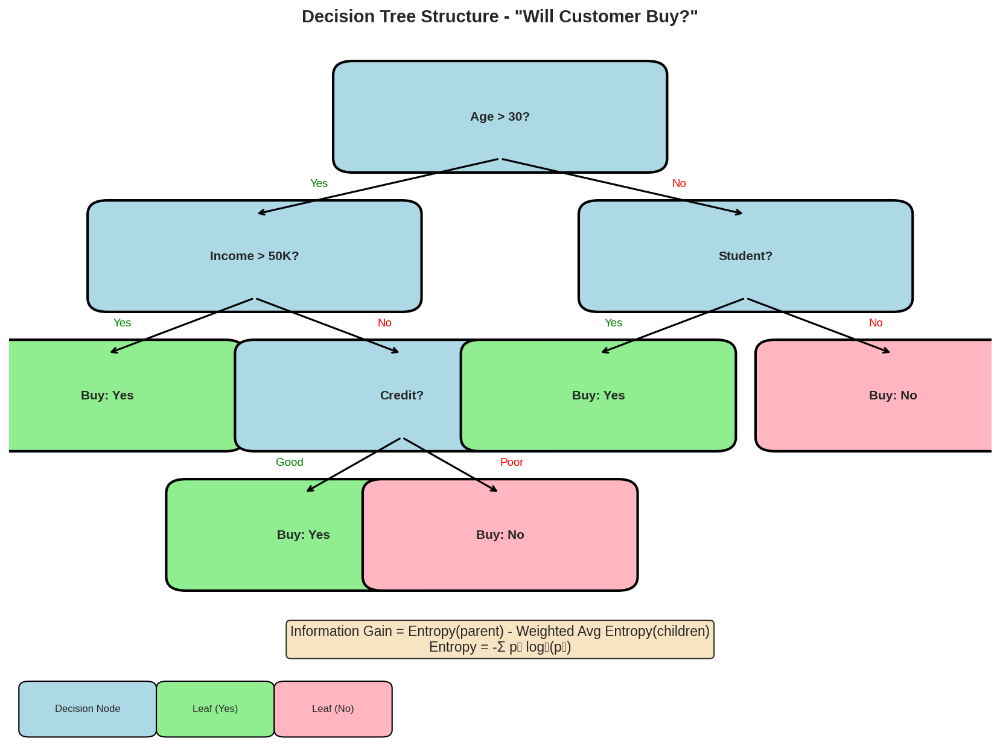

*This visualization shows a decision tree for predicting customer purchase behavior. Starting from the root node (Age > 30?), the tree splits based on various conditions. Green leaf nodes indicate "Buy: Yes" predictions, while pink nodes indicate "Buy: No". The formula for Information Gain is shown at the bottom.*

**Notable algorithms:**
- ID3 (Iterative Dichotomiser 3)
- C4.5/C5.0
- CART (Classification and Regression Tree)
- CHAID

**Key questions:**
- Which attribute to split on at each node?
- When to stop splitting?

---

### Q12. What are Entropy and Information Gain in Decision Trees?

**Entropy** measures homogeneity:
- 0 = completely homogeneous
- 1 = equally divided

**Information Gain** = Entropy(before split) - Weighted Average Entropy(after split)

**CART** uses Gini Impurity; **ID3** uses Entropy.

Choose the attribute with highest information gain as the decision node.

---

### Q13. What is pruning in Decision Trees?

Pruning reduces tree size by removing sections that provide little classification power. It prevents overfitting by:
- Removing sub-nodes of decision nodes
- Simplifying the model

---

### Q14. What is logistic regression?

Logistic Regression predicts binary outcomes from a linear combination of predictor variables using a sigmoid function:

P(Y|X) = σ(w · x + b)

**Example**: Predicting election win/loss based on campaign spending and time.

---

### Q15. What is Linear Regression?

A statistical technique predicting variable Y from variable X, where X is the predictor and Y is the criterion variable.

---

### Q16. What Are the Drawbacks of Linear Models?

- Assumes linearity
- Can't handle count or binary outcomes
- Can't solve overfitting/underfitting problems directly

---

### Q17. Difference between Regression and Classification?

Both are supervised learning techniques:
- **Classification**: Discrete labels (categorical output)
- **Regression**: Continuous values (numerical output)

---

### Q18. What are Recommender Systems?

Information filtering systems that predict user preferences or ratings for products. Used in movies (Netflix), products (Amazon), videos (YouTube), etc.

---

### Q19. What is Collaborative Filtering? And Content-Based?

- **Collaborative Filtering**: Recommends based on similar users' preferences
- **Content-Based**: Recommends based on item similarity

---

### Q20. How can outlier values be treated?

1. Replace with mean or median
2. Standardize the feature
3. Log transform
4. Drop the value
5. Cap at first/third quartile (>2σ)

---

### Q21. What are the various steps in an analytics project?

1. Understand the business problem
2. Explore and familiarize with data
3. Prepare data (outliers, missing values, transformations)
4. Run models, analyze results, iterate
5. Validate with new data
6. Implement and track performance

---

### Q22. How do you treat missing values during analysis?

1. Identify variables with missing values
2. Look for patterns (may reveal business insights)
3. If no patterns: impute with mean/median or ignore
4. For categorical: assign default value
5. If >80% missing: consider dropping the variable

---

### Q23. How to define the number of clusters in clustering?

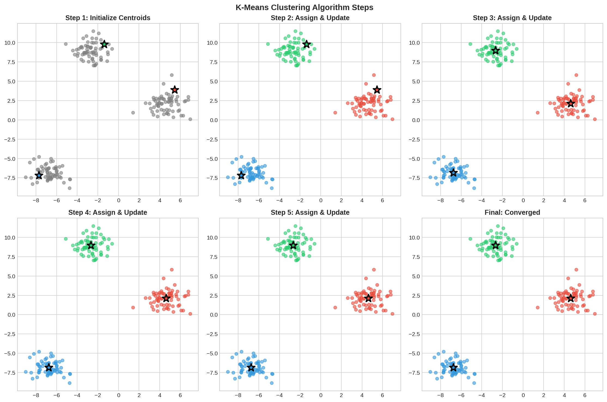

*This visualization shows the K-Means clustering algorithm in action over 6 steps. Starting with random centroids (stars), points are assigned to the nearest centroid, then centroids are updated to the mean of their assigned points. This process repeats until convergence.*

**Elbow Method (WSS)**:
1. Plot Within-Sum-of-Squares vs. number of clusters
2. Find the "elbow" point where WSS stops decreasing significantly

**Hierarchical Clustering**:
1. Build dendrogram
2. Draw horizontal line through longest vertical distance
3. Count vertical lines crossed = number of clusters

---

### Q24. What is Ensemble Learning?

Using multiple learning algorithms to obtain better predictive performance than any single algorithm. "Weak learners" combine to form a "strong learner."

---

### Q25. Describe Bagging and Boosting

**Bagging (Bootstrap Aggregating)**:
- Train similar learners on random subsamples
- Take mean of predictions
- Reduces variance
- Runs in parallel

**Boosting**:
- Iteratively adjust weights based on misclassifications
- Reduces bias
- Runs sequentially
- Examples: AdaBoost, XGBoost, GradientBoost

---

### Q26. What is a Random Forest? How does it work?

An ensemble of decision trees capable of:
- Regression and classification
- Dimensionality reduction
- Handling missing values and outliers

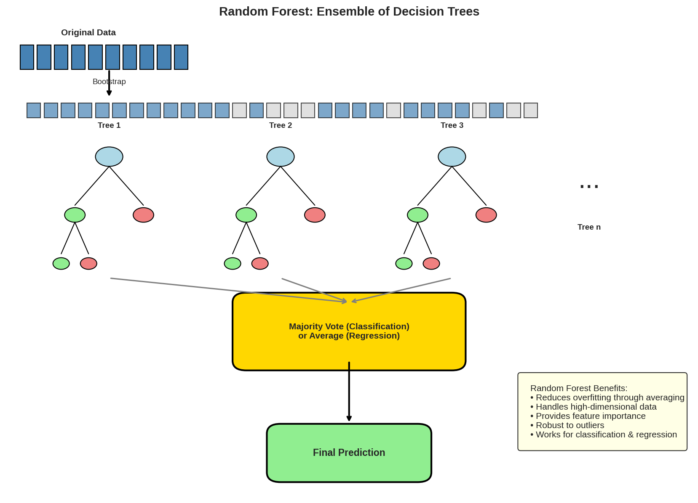

*This diagram shows how Random Forest works: Original data is bootstrapped (sampled with replacement) to create different training sets. Each tree is trained on a different bootstrap sample. Final predictions are made by majority vote (classification) or averaging (regression) across all trees.*

**Process**: Grow multiple trees, each voting on classification. Final prediction is the majority vote (classification) or average (regression).

---

### Q27. How Do You Work Towards a Random Forest?

1. Sample N cases with replacement (≈66% of data)
2. At each node, select m random predictor variables
3. Find best split using objective function
4. Split node into daughter nodes
5. Repeat to build tree
6. Build T trees for the forest

**m values**: √p, √p, 2√p (Breiman's suggestions)

---

### Q28. Cross-validation for time series data?

Use **forward chaining** instead of k-fold:
```
fold 1: training[1], test[2]
fold 2: training[1,2], test[3]
fold 3: training[1,2,3], test[4]
...
```

---

### Q29. What is a Box-Cox Transformation?

A statistical technique to transform non-normal dependent variables into a normal shape, enabling broader statistical testing.

---

### Q30. When should an algorithm be updated?

- When data streams require model evolution
- Underlying data source changes
- Non-stationarity (mean/variance changes over time)
- Algorithm underperforms

---

### Q31. Training with limited RAM (4GB) on large dataset (10GB)?

**For Neural Networks**:
- Use batch processing with NumPy arrays
- NumPy creates memory mapping without loading full dataset
- Use small batch sizes

**For SVM**:
- Use partial_fit method
- Divide into smaller subsets
- Train incrementally

---

## Deep Learning

### Q1. What is Deep Learning?

A paradigm of machine learning showing analogy with human neurons. Uses multi-layer neural networks for learning representations of data.

---

### Q2. Difference between Machine Learning and Deep Learning?

| Machine Learning | Deep Learning |
|---|---|
| Requires structured data | Works with unstructured data (images, text) |
| Manual feature engineering | Automatic feature learning |
| Needs less data | Requires large datasets |
| Human intervention for errors | Self-correcting through layers |

---

### Q3. Why is Deep Learning popular now?

1. Increase in data availability
2. Growth in hardware resources (GPUs)
3. Better algorithms and architectures

---

### Q4. What is Reinforcement Learning?

Learning to take actions to maximize cumulative reward through trial and error.

**Components:**
- Environment: Space where RL operates
- State: Data related to past actions
- Action: Action taken
- Reward: Feedback from last action
- Observation: Data about environment

---

### Q5-Q6. What are Artificial Neural Networks?

Neural networks inspired by biological neurons, adapting to changing inputs without redesigning output criteria.

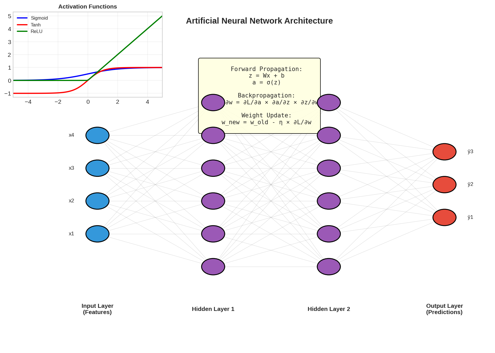

*This visualization shows a fully-connected neural network with an input layer (4 neurons), two hidden layers (6 neurons each), and an output layer (3 neurons). The inset shows common activation functions (Sigmoid, Tanh, ReLU), and the box contains the key formulas for forward propagation, backpropagation, and weight updates.*

**Structure**: Input layer → Hidden layers (with weighted sums, bias, activation functions) → Output layer

---

### Q7. How Are Weights Initialized?

- **All zeros**: Makes model linear, all neurons identical (useless)
- **Random (close to 0)**: Better accuracy, different neurons perform different computations (preferred method)

---

### Q8. What Is the Cost Function?

A measure of model performance error. Used to compute output layer error during backpropagation.

**Example**: Mean Squared Error: J = ½Σ(y - ŷ)²

---

### Q9. What Are Hyperparameters?

Parameters set before learning begins that determine training and network structure:
- Number of hidden units
- Learning rate
- Epochs
- Batch size

---

### Q10. Effects of Learning Rate

- **Too low**: Slow training, many updates needed
- **Too high**: Divergent behavior, may fail to converge

---

### Q11. Epoch vs Batch vs Iteration

- **Epoch**: One forward + backward pass of ALL training examples
- **Batch**: Number of examples processed together
- **Iteration**: Number of batches per epoch (= dataset size / batch size)

---

### Q12. What Are the Different Layers in CNN?

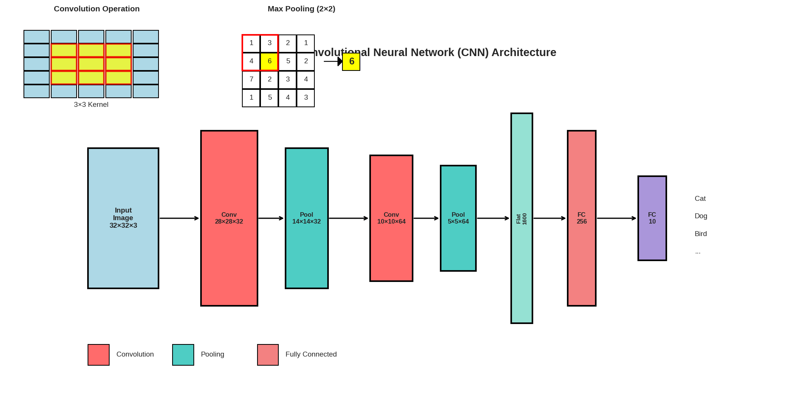

*This visualization shows a complete CNN pipeline for image classification. The input image passes through convolution layers (feature extraction), pooling layers (dimensionality reduction), and fully connected layers (classification). The inset illustrations show how convolution (sliding a 3×3 kernel) and max pooling (selecting the maximum value in each region) operations work.*

1. **Convolutional Layer**: Applies filters to detect features
2. **ReLU/Activation Layer**: Introduces non-linearity, converts negatives to zero
3. **Pooling Layer**: Down-samples to reduce dimensionality
4. **Fully Connected Layer**: Classifies features

---

### Q13. What Is Pooling in CNN?

Down-sampling operation that reduces spatial dimensions while retaining important information. Common types: Max Pooling, Average Pooling.

---

### Q14. What are Recurrent Neural Networks (RNNs)?

Neural networks designed for sequential data with loops allowing information persistence across time steps.

**Key features**:
- Parameter sharing across time steps
- Hidden state captures sequential context
- Used for: Speech recognition, language modeling, translation

---

### Q15. How Does an LSTM Network Work?

Long Short-Term Memory networks solve the vanishing gradient problem in RNNs.

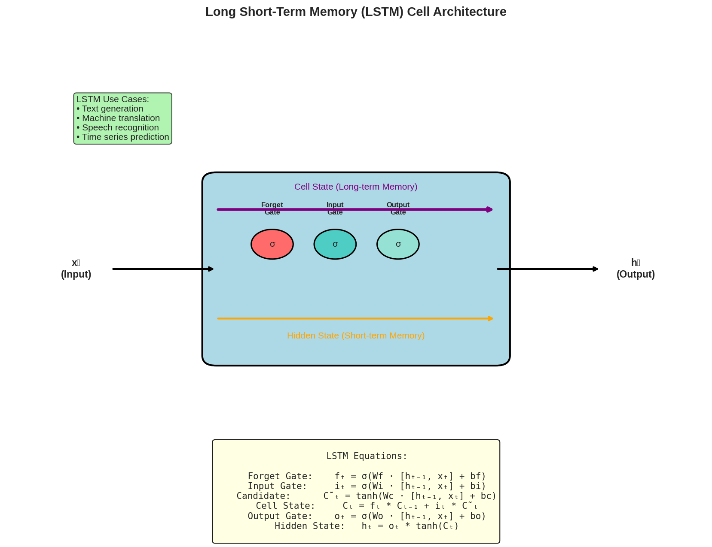

*This diagram shows an LSTM cell with its three gates: Forget Gate (decides what to discard), Input Gate (decides what new information to store), and Output Gate (decides what to output). The cell state (purple line) carries long-term memory, while the hidden state (orange line) carries short-term memory. The formulas for each gate are provided.*

**Three steps:**
1. Forget gate: Decide what to forget
2. Input gate: Selectively update cell state
3. Output gate: Decide what to output

**Key**: Cell state runs through with minimal interaction, allowing long-term memory.

---

### Q16. What Is a Multi-layer Perceptron (MLP)?

A neural network with input, hidden, and output layers using non-linear activation functions and backpropagation for training.

---

### Q17. Explain Gradient Descent

Iterative optimization to find the minimum of a function:

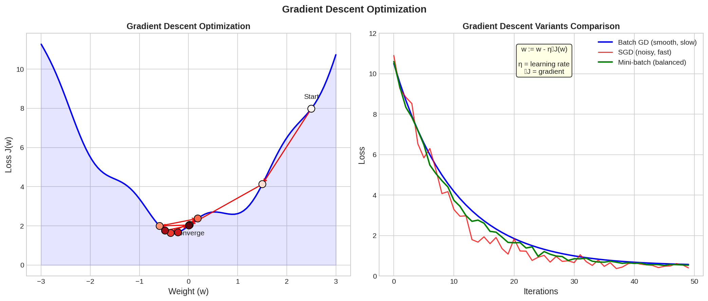

*Left panel shows gradient descent on a loss function: Starting from a high point, the algorithm iteratively moves in the direction of steepest descent until it converges to a minimum. Right panel compares three variants: Batch GD (smooth but slow), SGD (noisy but fast), and Mini-batch (balanced approach).*

1. Compute gradient (slope) at current point
2. Move in opposite direction of gradient
3. Repeat until convergence

---

### Q18. What are Exploding Gradients?

When error gradients grow exponentially large during training, causing:
- Unstable model
- NaN values
- Very large weights

**Solutions**: Redesign network, use LSTM, gradient clipping, weight regularization

---

### Q19. What are Vanishing Gradients?

When gradients become too small during backpropagation, stopping learning.

**Solutions:**
1. Use ReLU activation
2. Use LSTM for RNNs
3. Use ResNet (residual connections)
4. Gradient checking

---

### Q20. What is Backpropagation?

Training algorithm that updates weights recursively from output to input:

w_new = w_old - η∇L(w)

**Steps:**
1. Forward propagation
2. Compute gradients using output and target
3. Back propagate gradients
4. Update weights

---

### Q21. What are the variants of Backpropagation?

1. **Stochastic Gradient Descent (SGD)**: One example at a time
2. **Batch Gradient Descent**: All examples at once
3. **Mini-batch Gradient Descent**: Small batches (best of both)

---

### Q22. What are the different Deep Learning Frameworks?

- **PyTorch**: Facebook's library for computer vision and NLP
- **TensorFlow**: Google's library with symbolic math
- **Keras**: High-level API running on TensorFlow
- **Microsoft Cognitive Toolkit**: For neural network series

---

### Q23. Role of Activation Functions?

Introduce non-linearity, enabling learning of complex functions. Without them, neural networks would only learn linear combinations.

---

### Q24. Machine Learning Libraries by Purpose

| Purpose | Libraries |
|---|---|
| Scientific Computation | NumPy |
| Tabular Data | Pandas, GeoPandas |
| Modeling & Preprocessing | Scikit-learn |
| Time Series | Statsmodels |
| Text Processing | NLTK, RegEx |
| Deep Learning | TensorFlow, PyTorch |
| Visualization | Seaborn, Bokeh |
| Plotting | Matplotlib |

---

### Q25. What is an Auto-Encoder?

Neural network that learns to compress input to a lower-dimensional representation and reconstruct it. Used for dimensionality reduction and feature learning.

---

### Q26. What is a Boltzmann Machine?

Stochastic neural network that learns features representing complex regularities. Restricted Boltzmann Machines have faster learning with single feature detector layer.

---

### Q27. What Is Dropout and Batch Normalization?

- **Dropout**: Randomly dropping nodes (typically 20%) to prevent overfitting
- **Batch Normalization**: Normalizing layer inputs to have zero mean and unit standard deviation

---

### Q28-Q31. TensorFlow Concepts

- **Tensor**: Multi-dimensional array of data
- **Computational Graph**: Network of nodes (operations) and edges (tensors)
- **DataFlow Graph**: Data flows through the computation graph

---

## Miscellaneous

### Q1. Steps in Making a Decision Tree

1. Take entire dataset as input
2. Calculate entropy of target variable
3. Calculate information gain of all attributes
4. Choose highest information gain as root node
5. Repeat on each branch until leaf nodes finalized

---

### Q2. How to Build a Random Forest?

1. Randomly select k features from m total (k << m)
2. Calculate node d using best split point
3. Split node into daughter nodes
4. Repeat until leaf nodes finalized
5. Build n trees by repeating steps 1-4

---

### Q3-Q4. Feature Selection Methods

**Filter Methods:**
- Linear Discriminant Analysis
- ANOVA
- Chi-Square

**Wrapper Methods:**
- Forward Selection
- Backward Selection
- Recursive Feature Elimination

---

### Q5. FizzBuzz in Python

```python
for x in range(1, 51):
    if x % 3 == 0 and x % 5 == 0:
        print('fizzbuzz')
    elif x % 3 == 0:
        print('fizz')
    elif x % 5 == 0:
        print('buzz')
    else:
        print(x)
```

---

### Q6. Handling >30% Missing Values

- **Large dataset**: Remove rows with missing values
- **Small dataset**: Impute with mean/median/mode
- **Alternative**: Use KNN imputation

---

### Q7. Euclidean Distance in Python

```python
from math import sqrt
plot1 = [1, 3]
plot2 = [2, 5]
euclidean_distance = sqrt((plot1[0]-plot2[0])**2 + (plot1[1]-plot2[1])**2)
```

---

### Q8. What is Dimensionality Reduction?

Converting high-dimensional data to lower dimensions while preserving information.

**Benefits:**
- Reduces storage space
- Reduces computation time
- Removes redundant features

---

### Q9-Q11. Model Maintenance (CREM)

1. **Monitor**: Track performance accuracy
2. **Evaluate**: Calculate current model metrics
3. **Compare**: Compare new models
4. **Rebuild**: Rebuild on current data

---

### Q12. Amazon's "People who bought this also bought..."

Uses **Collaborative Filtering** - predicting preferences based on other users' behavior and purchase history.

---

### Q13. What is a Generative Adversarial Network (GAN)?

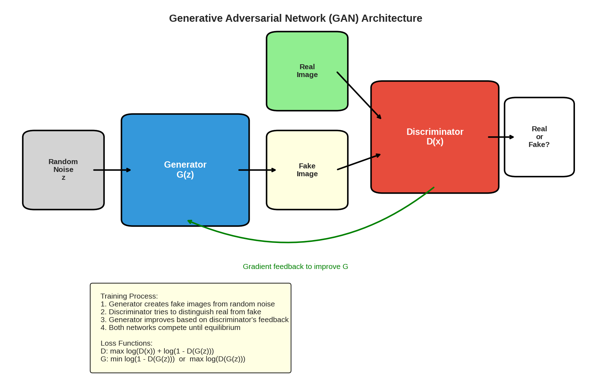

*This diagram shows the GAN architecture: A Generator (G) takes random noise as input and produces fake images. A Discriminator (D) tries to distinguish between real images and the generator's fake output. The two networks compete — the generator improves at creating realistic images while the discriminator improves at detecting fakes.*

Two components competing:
- **Generator**: Creates fake data
- **Discriminator**: Distinguishes real from fake

Goal: Generator produces data indistinguishable from real data.

---

### Q14. 96% Accuracy on Cancer Detection - Why Not Celebrate?

Cancer detection involves imbalanced data. 96% accuracy could mean missing 4% of actual cancer cases. Use Sensitivity, Specificity, and F1-score for proper evaluation.

---

### Q15. Entropy Calculation

For [0, 0, 0, 1, 1, 1, 1, 1]:
- p = 5/8, n = 3/8
- Entropy = -(5/8)log(5/8) - (3/8)log(3/8)

---

### Q16-Q19. Quick Answers

- **Q16**: Logistic regression for death probability prediction
- **Q17**: K-means clustering for finding similar users
- **Q18**: {grape, apple} must be a frequent itemset
- **Q19**: One-way ANOVA for coupon impact analysis

---

### Q20. What are Feature Vectors?

n-dimensional vectors of numerical features representing objects in a mathematical form for analysis.

---

### Q21. What is Root Cause Analysis?

Problem-solving technique for isolating root causes of faults. Originally developed for industrial accidents, now widely used in data science.

---

### Q22. Do Gradient Descent Methods Always Converge?

No. They may reach local minima instead of global optimum, depending on data and starting conditions.

---

### Q23. Popular Cloud Services for Data Science

- AWS (Amazon Web Services)
- Microsoft Azure
- Google Cloud Platform

---

### Q24. What is Canary Deployment?

Rolling out features to a subset of users (e.g., 10%) first:
1. Create two production environment clones
2. Have load balancer directing traffic
3. Gradually shift traffic to new version
4. Roll back if problems occur

---

### Q25. What is Blue-Green Deployment?

Running two identical production environments (Blue and Green):
- One is live, one is idle
- Deploy new version to idle environment
- Switch traffic after testing
- Enables instant rollback

---

## Python Programming

### NumPy

#### Q1. Why is NumPy better than lists?

NumPy arrays are faster, consume less memory, and provide extensive functionality for numerical operations.

#### Q2. Describe the map function

`map(function, iterable)` executes the function on all elements of the iterable.

#### Q3. Generate 100 random numbers from standard normal distribution

```python
np.random.rand(100)
```

#### Q4. Count occurrence of each value in array

```python
np.bincount(arr)
```

#### Q5. Does NumPy support NaN?

Yes, `nan` is a special floating point value defined by IEEE-754.

#### Q6. What does ravel() do?

Combines multiple numpy arrays into a single flattened array.

#### Q7. What is axis=0 and axis=1?

- `axis=0`: Operations along rows (vertical)
- `axis=1`: Operations along columns (horizontal)

#### Q8-Q25. NumPy Operations

```python
# Remove items from one array that exist in another
np.setdiff1d(a, b)

# Sort 2D array by column 2
arr[arr[:,1].argsort()]

# Reverse array
arr[::-1]

# Calculate percentile
np.percentile(arr, 40)

# Difference: NumPy vs SciPy
# NumPy: basic array operations
# SciPy: full-featured numerical algorithms

# Check for empty array
arr.size

# Find indices where condition is true
arr > 3

# Max and min of flattened array
np.amax(a), np.amin(a)

# Peak-to-peak (max - min) along axis
np.ptp(arr, 1)

# Median
np.median(arr)

# Mean, std, variance
np.mean(x), np.std(x), np.var(x)

# Covariance matrix
np.cov(x, y)

# Correlation coefficients
np.corrcoef(x, y)

# Histogram
np.histogram(nums, bins)

# Powers
np.power(x, 3)

# True division
np.true_divide(x, 3)
```

---

### Pandas

#### Q26. What is a Series?

A one-dimensional array capable of storing various data types with index labels.

#### Q27. Features making Pandas reliable

Memory efficient, data alignment, reshaping, merge/join, time series support.

#### Q28. What is reindexing?

Conforming DataFrame to a new index with optional filling logic.

#### Q29-Q50. Pandas Operations

```python
# Create Series from dict
pd.Series({'x': 0., 'y': 1., 'z': 2.})

# Copy Series
pd.Series.copy(deep=True)

# GroupBy
df.groupby('column')

# Convert DataFrame to NumPy array
df.to_numpy()

# First 5 rows
df.iloc[:5]

# Series to list
ds.tolist()

# Add column
df['new_col'] = pd.Series([1,2,3], index=['a','b','c'])

# Iterate over DataFrame
for index, row in df.iterrows():
    pass

# Difference between df['Name'] and df.loc[:, 'Name']
# First is a view, second is a copy
```

---

### Python Language

#### Q51. Programming or scripting language?

Python is a general-purpose programming language capable of scripting.

#### Q52. Is Python case sensitive?

Yes.

#### Q53. What is a lambda function?

An anonymous function with any number of parameters but one statement.

#### Q54. What is *args, **kwargs?

- `*args`: Pass variable number of positional arguments
- `**kwargs`: Pass variable number of keyword arguments

#### Q55. What are docstrings?

Documentation strings within triple quotes, serving as documentation.

#### Q56. Deep vs Shallow copy

- **Shallow**: Copies reference pointers
- **Deep**: Creates new object with new references

#### Q57. What is a generator?

A function with `yield` expression, implementing iterators.

#### Q58. Remove duplicates from list

```python
list(set(a))
```

#### Q59. What is PEP8?

Python Enhancement Proposal 8 - style guidelines for Python code.

#### Q60. What are decorators?

Functions that add functionality to existing functions using `@decorator_name` syntax.

#### Q61. Lists vs Tuples

- **Lists**: Mutable
- **Tuples**: Immutable

#### Q62. What is self?

Keyword used to define instance of a class, explicitly used as first parameter.

---

### Jupyter Notebook

#### Q76. Main use of Jupyter?

Open-source web application for creating/sharing code with live output and visualizations.

#### Q77-Q100. Jupyter Tips

```python
# Increase cell width
display(HTML("<style>.container { width:100% !important; }</style>"))

# Convert notebook to Python
jupyter nbconvert --to script [NOTEBOOK].ipynb

# Measure execution time
%%time

# Make inline plots larger
fig = plt.figure(figsize=(18, 16), dpi=80)

# Pass variables between notebooks
%store data  # Store
%store -r data  # Retrieve

# Run Python file
%run script.py

# High resolution plots
%config InlineBackend.figure_format = 'retina'
```

**Limitations**: Code versioning, debugging not scalable; hard to run async tasks.

---

## Top 100 Machine Learning Questions

*(Selected highlights from the comprehensive Q&A section)*

### Key Concepts

**Q1. Supervised vs Unsupervised**
- Supervised: Labeled data (stock prediction)
- Unsupervised: Unlabeled data (spam classification)

**Q2. Parametric vs Non-parametric Models**
- Parametric: Finite parameters (linear regression, logistic regression)
- Non-parametric: Unbounded parameters (decision trees, k-NN)

**Q8. Bias-Variance Tradeoff**
- Simpler models: Low variance, high bias
- Complex models: High variance, low bias

**Q14. L1 vs L2 Regularization**
- L1 (Lasso): Sparse solutions, binary weighting
- L2 (Ridge): Spreads error among terms

**Q15. Fourier Transform**
Decomposes functions into symmetric components - common for audio/time series feature extraction.

**Q24. F1 Score**
Weighted average of precision and recall, best when true negatives don't matter.

**Q32. ROC Curve and AUC**
- ROC: TPR vs FPR at various thresholds
- AUC: Area under ROC, robust to class imbalance

**Q42. KNN vs K-means**
- K-NN: Supervised classification
- K-means: Unsupervised clustering

---

## Top 100 NLP Questions

*(Selected highlights)*

### Key Concepts

**Q1. Keyword Normalization**
Lemmatization converts keywords to base form (playing → play).

**Q7. Stemming vs Lemmatization**
Both are keyword normalization techniques.

**Q9. TF-IDF**
- TF = term frequency in document
- IDF = log(total docs / docs containing term)
- Identifies important words, not just frequent ones

**Q15. TF-IDF Purpose**
Establishes word importance in document context, not just frequency.

**Q19-Q32. Word Embeddings**


*Left panel shows words plotted in 2D embedding space where semantically similar words cluster together. The relationship "king - man + woman ≈ queen" demonstrates the algebraic properties of word embeddings. Right panel compares Word2Vec, GloVe, ELMo, and BERT models.*

| Model | Features |
|---|---|
| Word2Vec | Word vectors, no context |
| GloVe | Word vectors, no context |
| ELMo | Context-aware, bidirectional LSTM |
| BERT | Bidirectional, transformer, transfer learning |
| GPT | Unidirectional, transformer |
| XLNet | Permutation language modeling |

**Q34. NLP Use Cases**
Sentiment analysis, translation, summarization, Q&A, chatbots, topic classification, intent extraction.

**Q42. NLTK vs SpaCy**
- NLTK: Multiple algorithms, more languages
- SpaCy: Best algorithm only, object-oriented, supports word vectors

**Q44. Bag of Words**
Creates occurrence matrix based on word frequencies, ignoring grammar/order.

**Q67. Preprocessing Steps**
1. Case normalization
2. Punctuation/stopword removal
3. Lemmatizing/stemming
4. Generalizing irrelevant information

**Q68. Encoder-Decoder Architecture**
- Encoder: Transforms input to fixed-dimensional vector
- Decoder: Transforms vector to output sequence
- Used in machine translation

**Q69. Attention Mechanisms**
Function of hidden weights at each time step, solving information loss in encoder-decoder networks.

---

## Top 100 Computer Vision Questions

*(Selected highlights)*

### Key Concepts

**Q3. Why CNNs for Images?**
Convolutions preserve spatial information and provide translation invariance.

**Q5. Why Max-pooling?**
Reduces computation, retains semantic information, adds translation invariance.

**Q7. Significance of Residual Networks**
Allow direct feature access from previous layers, enabling training of very deep networks.

**Q8. Batch Normalization**
Normalizes layer inputs to zero mean and unit standard deviation, stabilizing training.

**Q9. Why Small Kernels (3x3)?**
- Same receptive field with fewer parameters
- More filters = more activation functions = better discrimination

**Q19. Vanishing Gradient**
Gradients become too small in deep networks; addressed by ReLU, batch normalization.

**Q20. Dropouts**
Randomly dropping units prevents overfitting by reducing co-adaptation.

**Q29. SIFT Algorithm**
Scale-Invariant Feature Transform:
1. Scale-space extrema detection
2. Keypoint localization
3. Orientation assignment
4. Keypoint matching

**Q32. Image Segmentation**
Extracting related pixels; techniques include active contours, level sets, graph-based merging.

**Q33-Q35. Segmentation Types**
- **Semantic**: Categorize every pixel by class
- **Instance**: Distinguish different objects of same class
- **Panoptic**: Combination of both

**Q39. Optical Flow**
Pattern of apparent motion between consecutive frames, used for structure from motion, video compression.

**Q46. Non-maximum Suppression (NMS)**
Keeps only local maxima, removing non-maximum pixels; widely used in object detection.

**Q70. Auto-encoder**
Neural network learning to compress and reconstruct input; uses dimensionality reduction.

**Q81-Q93. GANs**

**Components**: Generator + Discriminator

**Issues**:
- Non-convergence
- Mode collapse
- Diminished gradient
- Hyperparameter sensitivity

**Evaluation**: Inception Score, FID, Precision/Recall

**Variants**: Progressive, Conditional, CycleGAN

---

## References

### Original Document Credits
- Steve Nouri (LinkedIn)
- Davide Callegaro (LinkedIn)
- KDnuggets, Simplilearn, Edureka, Guru99
- Hackernoon, Datacamp, Nitin Panwar, Michael Rundell

### Additional Sources
- edureka.co
- kausalvikash.in
- wisdomjobs.com
- stackoverflow.com
- techbeamers.com
- w3resource.com
- javatpoint.com
- geeksforgeeks.org
- onlineinterviewquestions.com
- analyticsindiamag.com
- interviewbit.com
- guru99.com

---

*This document is composed of various Data Science Interview Questions compilations I found on many sources across the internet, enhanced with 20 explanatory graphics and visualizations.*

*If attributions are missing, please let me know or submit a PR for the update.*
